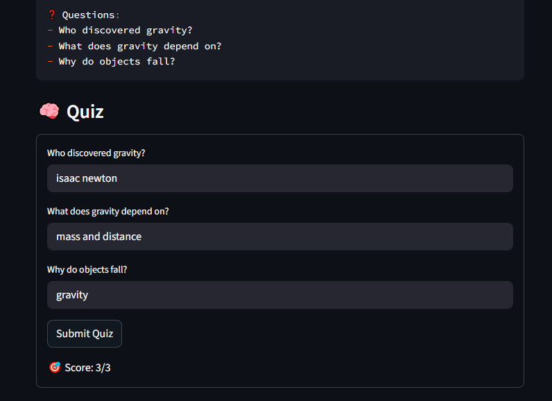
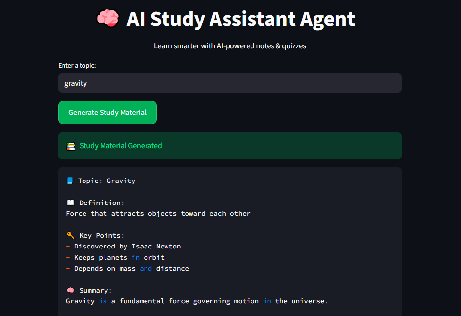

# 🧠 AI Study Assistant Agent (No API)

An Agentic AI system that generates structured study material and quizzes — built entirely **without using any external API**.

> A deployed, interactive AI-style learning assistant with real-time quiz evaluation and session-based UX.

---

## 🌐 Live Demo

👉 **[Try the Live App](https://ai-study-assistant-agent.streamlit.app)**

---

## 📸 Demo
> Real-time study generation and quiz evaluation in a clean UI.

### 🔹 Study Output


### 🔹 Quiz Interface


---

## 🚀 Features

- 📘 Generates topic-based study notes  
- 🔑 Extracts key points  
- 🧠 Provides summaries  
- ❓ Interactive quiz mode  
- 🎯 Score evaluation  
- 🧾 Memory tracking of studied topics  
- ⚡ Works without API (rule-based agent system)

---

## ⚙️ How It Works

User Input → Planner → Knowledge Base → Formatter → Memory → Output

---

## 📁 Project Structure

```
study-agent/
│
├── app.py
├── agent/
│   ├── main.py
│   ├── planner.py
│   ├── tools.py
│   ├── formatter.py
│   └── memory.py
│
├── data/
│   └── topics.json
│
├── output/
│   └── sample.txt
│
└── README.md
```